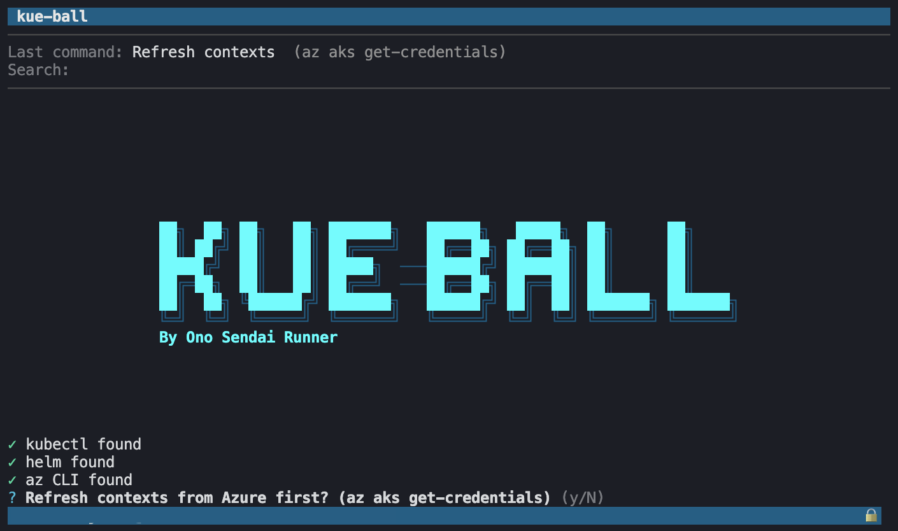
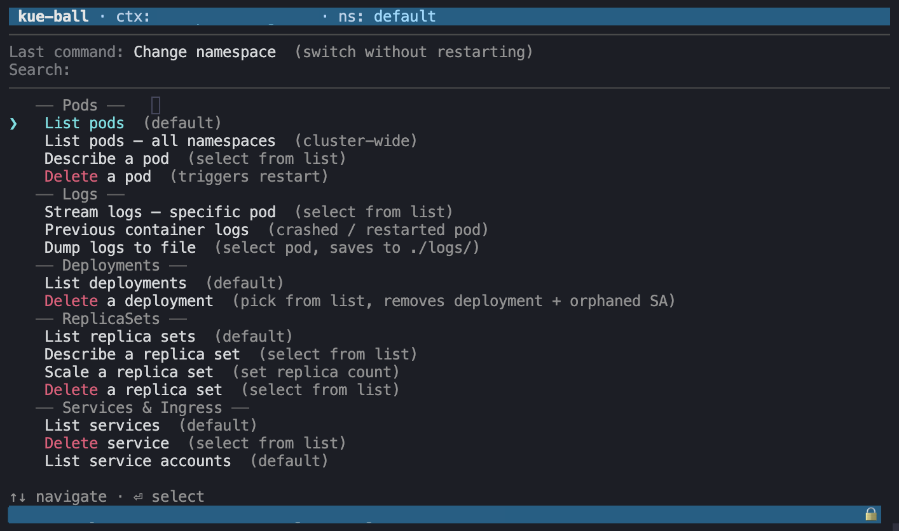

# kue-ball

<table>
  <tr>
    <td>
      
    </td>
    <td>
      
    </td>
  </tr>
</table>


Interactive `kubectl` wizard CLI for AKS clusters for use on mac (and possibly linux) devices. Pick a context, pick a namespace, and run common operations through a fuzzy-searchable menu — no flags to memorise.

## Requirements

- Node.js ≥ 22
- `kubectl` — `brew install kubectl`
- `az` (Azure CLI) — `brew install azure-cli` *(for context refresh only)*
- `helm` — `brew install helm` *(optional, for Helm commands)*
- `jq` — `brew install jq` *(optional, pretty-prints JSON log output)*

## Install

### Homebrew (recommended)

```bash
brew tap paperschool/kue-ball
brew install kue-ball
```

### npm (global)

```bash
npm install -g .
kue-ball
```

### Run directly (development)

```bash
npm install
npm start
# or
node src/main.js
```

## Configuration

The wizard works out of the box with zero config. Optionally set environment variables to pre-select your app and namespace:

| Variable                   | Purpose                                                | Default   |
| -------------------------- | ------------------------------------------------------ | --------- |
| `KUBECTL_WIZARD_APP`       | App name used for log selectors & deployment shortcuts | *(none)*  |
| `KUBECTL_WIZARD_NAMESPACE` | Namespace pre-selected at startup                      | `default` |
| `KUBECTL_WIZARD_CONTEXT`   | kubeconfig context floated to the top of the list      | *(none)*  |

Example:

```bash
KUBECTL_WIZARD_APP=my-service KUBECTL_WIZARD_NAMESPACE=my-ns kue-ball
```

Or add an alias to your shell profile:

```bash
alias kube-myapp='KUBECTL_WIZARD_APP=my-service KUBECTL_WIZARD_NAMESPACE=my-ns kue-ball'
```

## How it works

`kue-ball` uses a **two-level menu**: pick a resource type, then pick the action you want to perform on it. Every picker is fuzzy-searchable. Backspace or `←` steps back to the previous menu.

```
  Resource picker            Verb picker (per resource)
  ─────────────────          ──────────────────────────
  Pods                  →    List
  Deployments                Describe        (e to edit in the pager)
  ReplicaSets                Delete          (confirms first)
  ConfigMaps                 Stream logs
  Secrets                    Shell into pod
  Nodes                      Scale
  PVCs                       …
  …                          ← Back to resources
  Helm
  Ping
  Events
  Contexts
  Exit
```

The same verb (e.g. `delete`) works against every resource that supports it — no per-resource menu to remember.

### Resources

17 kubernetes resources are registered out of the box, grouped by domain:

| Group | Resources |
|---|---|
| **Workloads** | Pods, Deployments, ReplicaSets, StatefulSets, DaemonSets, Jobs, CronJobs |
| **Config** | ConfigMaps, Secrets |
| **Networking** | Services, Ingress, ServiceAccounts, VirtualServices |
| **Cluster** | Nodes |
| **Storage** | HPA, PVCs, PVs |

Cluster-scoped resources (Nodes, PVs) automatically omit `--namespace` from every kubectl call.

### Verbs

**Universal verbs** work against any registered resource:

| Verb | What it does |
|---|---|
| `list` | `kubectl get {plural} -o wide` |
| `describe` | `kubectl describe {kind} {name}` — press `e` in the pager to launch `kubectl edit` |
| `edit` | `kubectl edit {kind} {name}` (honours `KUBE_EDITOR`, defaults to `nano`) |
| `delete` | `kubectl delete {kind} {name}` (confirms first) |

**Specific verbs** cover the resource-flavoured actions:

- `logs`, `logsPrevious`, `logsToFile` — stream / dump / save container logs (Pods + Jobs)
- `exec`, `execOneOff` — interactive shell or one-off command in a Pod
- `scale` — set replicas (Deployments / ReplicaSets / StatefulSets; confirms when scaling to 0)
- `rolloutStatus`, `rolloutHistory`, `rolloutUndo`, `rolloutRestart`, `rolloutPause`, `rolloutResume`
- `setImage`, `setEnv` — apply `kubectl set image` / `kubectl set env`
- `top` — resource usage (Pods, Nodes)
- `portForward` — `kubectl port-forward` with `q`/Esc to quit
- `triggerNow` — instantiate a Job from a CronJob
- `cordon`, `uncordon`, `drain`, `taint` — node lifecycle

Verb labels are colour-coded by intent: red `delete`, yellow `edit`, blue `logs*`, green `exec*`.

### Top-level extras

Alongside the resource picker, four items handle non-resource flows:

- **Helm** — list / delete releases, list pending or failed releases
- **Ping** — auto-discovers routes from Ingress / VirtualService and HTTP-pings them
- **Events** — recent events in the namespace, warnings only
- **Contexts** — refresh from Azure (`az aks get-credentials`), list, switch, change namespace

### Authentication error page

When a `kubectl` command fails with a permission / auth error (Forbidden, Unauthorized, 401/403, access denied, etc.), the wizard shows a yellow warning page instead of the raw stderr — with the salient error line and a prompt to check Azure login, PIM activation, and network connectivity.

### Adding a new resource

Adding a kubernetes resource to the wizard is a single registry entry in `src/lib/resources.js`:

```js
{
    kind: "poddisruptionbudget",
    plural: "poddisruptionbudgets",
    displayName: "PDBs",
    group: "Cluster",
    namespaced: true,
    universalVerbs: ["list", "describe", "edit", "delete"],
    specificVerbs: [],
}
```

The two-level menu picks it up automatically. No new command handler required.

## Subscription preferences

When refreshing contexts, the wizard remembers which Azure subscriptions you pick most often and surfaces them first. Preferences are stored in `~/.config/kue-ball/prefs.json`.

## Author

<div align="center">

**Connect with the me:**

Dominic Jomaa • [LinkedIn](https://www.linkedin.com/in/dominicjomaa/) • [Instagram](https://www.instagram.com/ono.sendai.runner/)

</div>