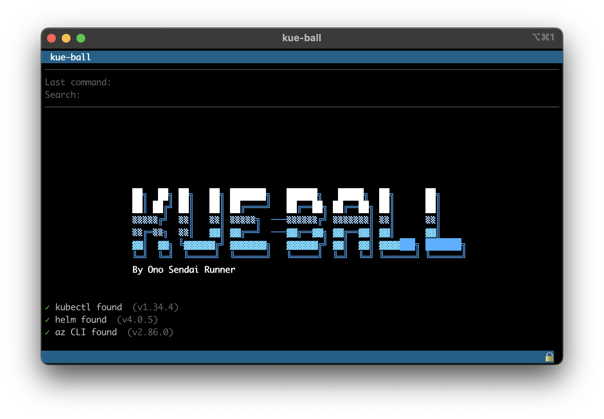
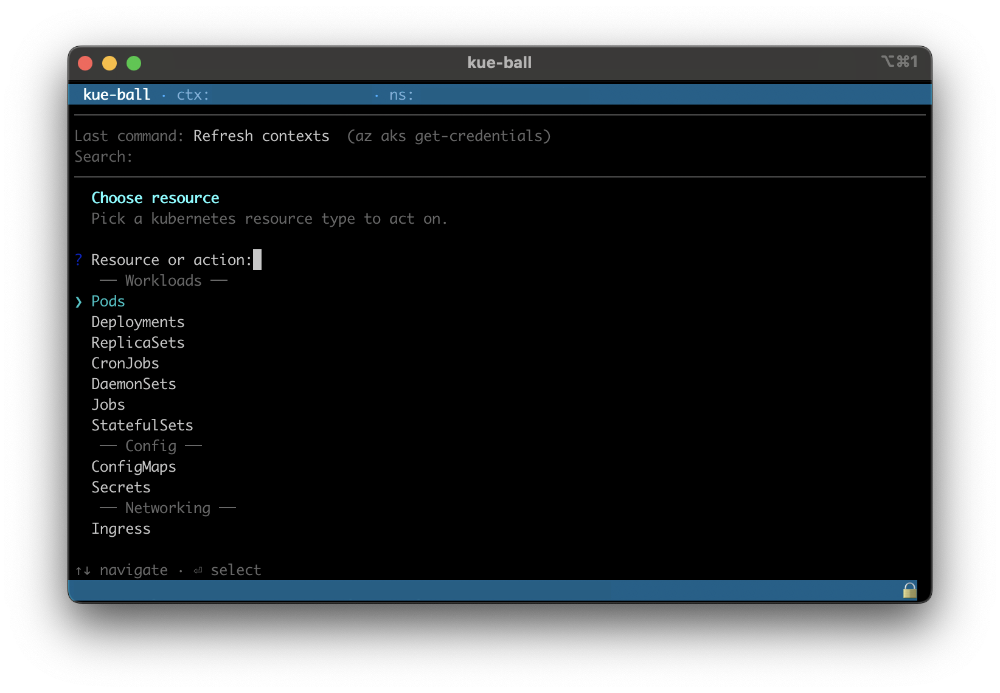
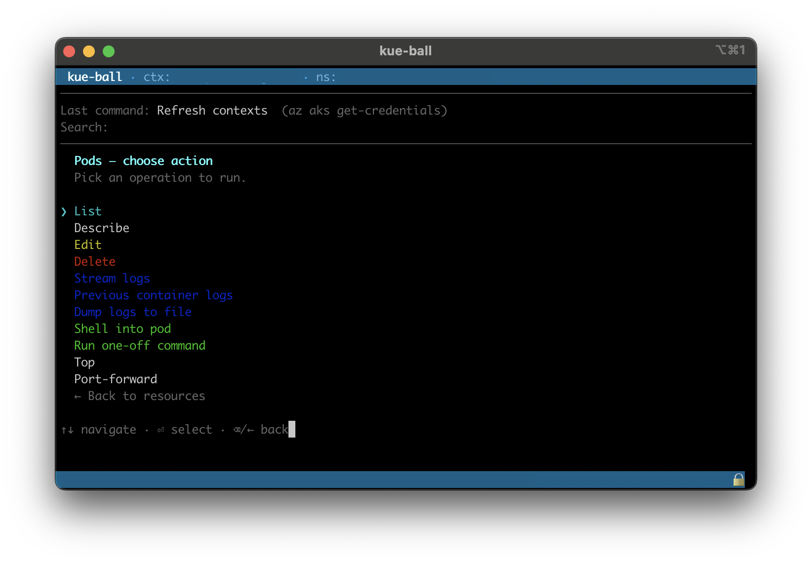

# kue-ball

<table>
  <tr>
    <td style="padding: 0; margin: 0">
      
    </td>
    <td style="padding: 0; margin: 0">
      
    </td>
    <td style="padding: 0; margin: 0">
      
    </td>
  </tr>
</table>


Interactive `kubectl` wizard CLI for AKS clusters. Runs on macOS, Linux, and Windows (via WSL2 — see [Install → Windows](#windows-via-wsl2)). Pick a context, pick a namespace, and run common operations through a fuzzy-searchable menu — no flags to memorise.

## Requirements

- **Platforms**: macOS, Linux, Windows (via WSL2 + Ubuntu — native PowerShell / `cmd.exe` not supported).
- Node.js ≥ 22
- `kubectl` — `brew install kubectl`
- `az` (Azure CLI) — `brew install azure-cli` *(for context refresh only)*
- `helm` — `brew install helm` *(optional, for Helm commands)*
- `jq` — `brew install jq` *(optional, pretty-prints JSON log output)*

## Install

### Homebrew (recommended)

```bash
brew tap paperschool/kue-ball
brew install kue-ball
```

### npm (global)

```bash
npm install -g .
kue-ball
```

### Run directly (development)

```bash
npm install
npm start
# or
node src/main.js
```

### Windows (via WSL2)

Native Windows (PowerShell, `cmd.exe`) is **not supported**. The supported path on Windows is WSL2 + Ubuntu, which runs `kue-ball` as a Linux binary.

1. **Enable WSL2 + install Ubuntu** (PowerShell as Administrator):

   ```powershell
   wsl --install -d Ubuntu
   ```

   Reboot when prompted. After reboot, the Ubuntu setup will ask you to create a Linux user + password.

2. **Open the Ubuntu shell** from the Start Menu (NOT a PowerShell `wsl` invocation — Start-Menu launches in Windows Terminal which is the supported TUI host).

3. **Install Node ≥ 22**:

   ```bash
   curl -fsSL https://deb.nodesource.com/setup_22.x | sudo -E bash -
   sudo apt-get install -y nodejs
   ```

4. **Install kubectl**:

   ```bash
   curl -LO "https://dl.k8s.io/release/$(curl -L -s https://dl.k8s.io/release/stable.txt)/bin/linux/amd64/kubectl"
   sudo install -o root -g root -m 0755 kubectl /usr/local/bin/kubectl
   ```

5. **Install `helm`** (optional, for Helm commands):

   ```bash
   curl https://raw.githubusercontent.com/helm/helm/main/scripts/get-helm-3 | bash
   ```

6. **Install `az`** (optional, for `Refresh contexts`):

   ```bash
   curl -sL https://aka.ms/InstallAzureCLIDeb | sudo bash
   az login --use-device-code   # device-code flow is the safe path inside WSL
   ```

7. **Clone into the WSL filesystem** — NOT into `/mnt/c/...`:

   > ⚠ Cloning into `/mnt/c/...` makes `npm install` 5–10× slower (every fs syscall crosses the Windows↔Linux boundary) and can break interactive prompts. Always work inside the WSL home (`~/dev/...`).

   ```bash
   mkdir -p ~/dev && cd ~/dev
   git clone https://github.com/paperschool/homebrew-kue-ball.git
   cd homebrew-kue-ball
   npm install
   ```

8. **Run it**:

   ```bash
   npm start
   ```

**Heads-up**: Windows Terminal (the default on Win 11) renders the TUI correctly with Cascadia Mono. Legacy `conhost.exe` is **not supported** — open Ubuntu from the Start Menu rather than via `wsl.exe` in legacy console. For known quirks and gotchas under WSL2, see [`docs/wsl2-known-caveats.md`](docs/wsl2-known-caveats.md).

### Run inside Docker (Mac dev shortcut)

Mac developers can approximate the WSL2 Ubuntu environment for testing without spinning up a Windows VM:

```bash
npm run docker:start
```

First run builds the image (~3 min); subsequent runs are instant. The container mounts `~/.kube` and `~/.azure` from the host so you can hit real clusters from inside. See [`docs/wsl2-known-caveats.md`](docs/wsl2-known-caveats.md) for what this verifies vs what still needs a real Windows host.

## Upgrading

If you installed via the Homebrew tap, upgrade with:

```bash
brew update
brew upgrade kue-ball
```

`brew update` refreshes the tap so brew sees the latest formula bump (auto-pushed by the release workflow on every `v*` tag); `brew upgrade kue-ball` then reinstalls from the new tarball. Confirm with `brew info kue-ball`.

If brew is being stubborn, force a fresh tap:

```bash
brew untap paperschool/kue-ball
brew tap paperschool/kue-ball
brew upgrade kue-ball
```

### npm / WSL installs

The Homebrew upgrade flow does NOT apply to npm or WSL installs.

- **git-clone install** (incl. WSL2): `cd <repo> && git pull && npm install`
- **global npm install**: re-run `npm install -g .` from the cloned repo to re-link.

## Configuration

The wizard works out of the box with zero config. Optionally set environment variables to pre-select your app and namespace:

| Variable                   | Purpose                                                | Default   |
| -------------------------- | ------------------------------------------------------ | --------- |
| `KUBECTL_WIZARD_APP`       | App name used for log selectors & deployment shortcuts | *(none)*  |
| `KUBECTL_WIZARD_NAMESPACE` | Namespace pre-selected at startup                      | `default` |
| `KUBECTL_WIZARD_CONTEXT`   | kubeconfig context floated to the top of the list      | *(none)*  |

Example:

```bash
KUBECTL_WIZARD_APP=my-service KUBECTL_WIZARD_NAMESPACE=my-ns kue-ball
```

Or add an alias to your shell profile:

```bash
alias kube-myapp='KUBECTL_WIZARD_APP=my-service KUBECTL_WIZARD_NAMESPACE=my-ns kue-ball'
```

## How it works

`kue-ball` uses a **two-level menu**: pick a resource type, then pick the action you want to perform on it. Every picker is fuzzy-searchable. Backspace or `←` steps back to the previous menu.

```
  Resource picker            Verb picker (per resource)
  ─────────────────          ──────────────────────────
  Pods                  →    List
  Deployments                Describe        (e to edit in the pager)
  ReplicaSets                Delete          (confirms first)
  ConfigMaps                 Stream logs
  Secrets                    Shell into pod
  Nodes                      Scale
  PVCs                       …
  …                          ← Back to resources
  Helm
  Ping
  Events
  Contexts
  Exit
```

The same verb (e.g. `delete`) works against every resource that supports it — no per-resource menu to remember.

### Resources

17 kubernetes resources are registered out of the box, grouped by domain:

| Group          | Resources                                                                |
| -------------- | ------------------------------------------------------------------------ |
| **Workloads**  | Pods, Deployments, ReplicaSets, StatefulSets, DaemonSets, Jobs, CronJobs |
| **Config**     | ConfigMaps, Secrets                                                      |
| **Networking** | Services, Ingress, ServiceAccounts, VirtualServices                      |
| **Cluster**    | Nodes                                                                    |
| **Storage**    | HPA, PVCs, PVs                                                           |

Cluster-scoped resources (Nodes, PVs) automatically omit `--namespace` from every kubectl call.

### Verbs

**Universal verbs** work against any registered resource:

| Verb       | What it does                                                                       |
| ---------- | ---------------------------------------------------------------------------------- |
| `list`     | `kubectl get {plural} -o wide`                                                     |
| `describe` | `kubectl describe {kind} {name}` — press `e` in the pager to launch `kubectl edit` |
| `edit`     | `kubectl edit {kind} {name}` (honours `KUBE_EDITOR`, defaults to `nano`)           |
| `delete`   | `kubectl delete {kind} {name}` (confirms first)                                    |

**Specific verbs** cover the resource-flavoured actions:

- `logs`, `logsPrevious`, `logsToFile` — stream / dump / save container logs (Pods + Jobs)
- `exec`, `execOneOff` — interactive shell or one-off command in a Pod
- `scale` — set replicas (Deployments / ReplicaSets / StatefulSets; confirms when scaling to 0)
- `rolloutStatus`, `rolloutHistory`, `rolloutUndo`, `rolloutRestart`, `rolloutPause`, `rolloutResume`
- `setImage`, `setEnv` — apply `kubectl set image` / `kubectl set env`
- `top` — resource usage (Pods, Nodes)
- `portForward` — `kubectl port-forward` with `q`/Esc to quit
- `triggerNow` — instantiate a Job from a CronJob
- `cordon`, `uncordon`, `drain`, `taint` — node lifecycle

Verb labels are colour-coded by intent: red `delete`, yellow `edit`, blue `logs*`, green `exec*`.

### Top-level extras

Alongside the resource picker, four items handle non-resource flows:

- **Helm** — list / delete releases, list pending or failed releases
- **Ping** — auto-discovers routes from Ingress / VirtualService and HTTP-pings them
- **Events** — recent events in the namespace, warnings only
- **Contexts** — refresh from Azure (`az aks get-credentials`), list, switch, change namespace

### Authentication error page

When a `kubectl` command fails with a permission / auth error (Forbidden, Unauthorized, 401/403, access denied, etc.), the wizard shows a yellow warning page instead of the raw stderr — with the salient error line and a prompt to check Azure login, PIM activation, and network connectivity.

### Adding a new resource

Adding a kubernetes resource to the wizard is a single registry entry in `src/lib/resources.js`:

```js
{
    kind: "poddisruptionbudget",
    plural: "poddisruptionbudgets",
    displayName: "PDBs",
    group: "Cluster",
    namespaced: true,
    universalVerbs: ["list", "describe", "edit", "delete"],
    specificVerbs: [],
}
```

The two-level menu picks it up automatically. No new command handler required.

## Subscription preferences

When refreshing contexts, the wizard remembers which Azure subscriptions you pick most often and surfaces them first. Preferences are stored in `~/.config/kue-ball/prefs.json`.

## Author

<div align="center">

**Connect with the me:**

Dominic Jomaa • [LinkedIn](https://www.linkedin.com/in/dominicjomaa/) • [Instagram](https://www.instagram.com/ono.sendai.runner/)

</div>